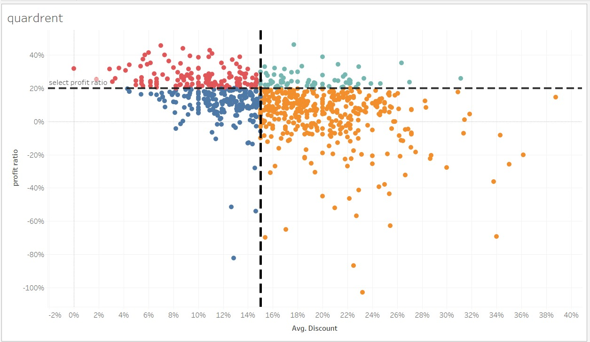

# 📊 Tableau Graph Gallery: 61 Essential Visualizations

Welcome to the **Tableau Graph Gallery** — a comprehensive Tableau project showcasing **61 different types of visualizations**, ranging from simple bar charts to advanced KPIs and geospatial maps.

This repository is a practical reference for data analysts, business intelligence professionals, and Tableau learners looking to expand their data visualization toolkit.

---

## 📌 Project Overview

This project aims to:
- Demonstrate the wide variety of chart types possible in Tableau.
- Serve as a go-to reference for implementing different chart styles.
- Help users understand best-fit use cases for each visualization.

Each visualization is built using sample or mock data, focusing on clarity, flexibility, and design best practices.

---

## screenshots





## 📷 Gallery of Visualizations

Here’s a categorized list of the 61 visualizations included in this project:

### 📊 Bar Charts
1. Row Bar Chart  
2. Column Bar Chart  
3. Side-By-Side Bar Chart  
4. Over Time Bar Chart  
5. Stacked Bar Chart  
6. Full 100% Stacked Bar Chart  
7. Multiple Small Bar Charts  
8. Bar-in-Bar Chart  
9. Barcode Chart  
21. Rounded Bar Chart  

### 📈 Line Charts
10. Line Chart  
11. Customized Line Charts  
12. Multiple Lines Chart  
13. Dual-Lines Chart  
14. Cumulative Line Chart  
15. Multiple Small Line Charts  
16. Highlighted Line Chart (1)  
17. Highlighted Line Chart (2)  
18. Bump Chart  
19. Sparkline Chart  

### 📏 Comparative Charts
20. Barbell Chart  
22. Slope Chart  
23. Bar & Line Chart (1)  
24. Bar & Line Chart (2)  
25. Bullet Chart  
26. Horizontal Lollipop Chart  
27. Vertical Lollipop Chart  

### 🌊 Area Charts
28. Area Chart  
29. Lined Area Chart  
30. Stacked Area Chart  
31. Full 100% Stacked Area Chart  
32. Multiple Small Area Charts  

### 🔘 Point-Based Charts
33. Scatter Plot  
34. Customized Scatter Plot  
35. Dot Plot  
36. Circle Timeline  

### 🍩 Pie & Donut
37. Pie Chart  
38. Donut Chart  

### 📦 Hierarchical/Matrix Charts
39. Treemap  
40. Heatmap  

### 🔵 Bubble & Symbol Charts
41. Bubble Chart  
42. Stacked Bubble Chart  

### 🗺️ Maps
43. Basic Map  
44. Map with Symbol  
45. Map without Background  
46. Night Vision Map  

### 🧮 Statistical/Distribution
47. Histogram (1x Measure)  
48. Histogram (2x Measure)  
49. Calendar  
50. Waterfall Chart  
51. Pareto Chart (1)  
52. Pareto Chart (2)  
53. Butterfly Chart (Tornado) (1)  
54. Butterfly Chart (Tornado) (2)  
55. Quadrant Chart  
56. Box Plot  

### 📊 KPIs & Progress
57. KPI Chart  
58. KPI & Bar Chart  
59. BANs  
60. Funnel Chart  
61. Progress Bar  

---

## 🛠️ Getting Started

### Requirements
- **Tableau Desktop** (version 2021.4 or newer recommended)

### Installation
1. Clone this repository:
   ```bash
   git clone https://github.com/Shubham496/graphs-tableau/
   ```

2. Open the `.twb` or `.twbx` files in Tableau Desktop.
3. Explore and customize the visualizations as needed.
4. Refer to the comments and documentation within each Tableau file for guidance on data sources and customization options.
5. Use your own datasets to replicate and adapt the visualizations.
6. Share your customized visualizations with the community!
7. If you create new visualizations or improve existing ones, consider contributing back to the repository via pull requests.
8. Follow best practices for data visualization to ensure clarity and effectiveness.
   


## Contributing

Contributions are welcome! Please open issues or submit pull requests to help improve this repository.

## License

This project is licensed under the MIT License.

## Contact Me

Feel free to reach out if you have any questions, suggestions, or just want to connect!

- **Email:** [iatco5h@gmail.com](mailto:iatco5h@gmail.com)
- **Phone:** +91 9520132466
- **LinkedIn:** [linkedin.com/in/Shubham](https://www.linkedin.com/in/shubham-singh-64827a228/)

I look forward to hearing from you!